# Tasha-Jane

[Visit the website here](https://rachaelbull.github.io/tasha-jane/)

Created to provide services for people looking for eyelash extensions. This website also includes basic information and explanations for each service; avoiding the presumption that the content is intended for a familiar audience. This website was made only for educational purposes. The idea that this website was based upon was my older sister Tasha. Having had her own beauty business for a couple of years now she has built herself up quite a number of both new and returning clients. Her main forms of contact and
advertisements are through Facebook and Instagram. As I feel very passionate about both my future career and progression in coding and programming, and my sisters business growing, I decided this would be the perfect project to put my heart and hard work into.

## **Introduction** ##

Welcome to my first project - Tasha Jane.

This project is meant for educational purposes only, to showcase my understanding of the languages and teaching I have learnt so far in the modules.
Within this file, I will break down in steps the making of this project website and the logic and reasonings behind it.

This project website is made up of these sections/pages:

1. Home (includes a brief understanding of the website)
2. Services page
3. Gallery page
4. Contact page

## UX

---

## **Strategy Plane** ##

One of the very first things I considered during the planning of this project website was who the audience would be and what they would expect/want.

Tasha Jane's target audience would be:

* Ages 18 and over
* New and regular users of the services
* People interested in the eyelash and eyebrow services provided
* Individuals looking for a brief understanding of the services
* People that have an interest in beauty

What I expect these users would be hoping for:

* Clear, brief information that confirms any basic queries they may have
* Descriptions of each service to help determine the one that's best for them
* Clear, pristine images that give the user an insight to what they are interested in purchasing

The goals from a business perspective are:

* To briefly educate users on the purpose and intention behind each service provided
* To build a bigger base of clients through an additional advertising platform
* To give users a clear and to-the-point indication of the industry and services that are being offered

The goals from a user's perspective are:

* To be able to find information directly related to what's being offered
* Feel comfortable and able to trust the services that are being offered
* Find helpful descriptions of the services to clearly underline the outcome of the services

**Creator Stories**

Firstly, I planned the project around the creators intentions. As the website's purpose is to provide some kind of help and guidance to users, I felt that it was important to go through, in depth, what I thought would be the best experience for my users.

* As a creator, I want to make sure that my website is attractive and intriguing to the human eye, making the user more inclined to remain and explore the website
* As a creator, I intend to make my website easy to use - making sure that the navigation is clear and easy to understand
* As a creator, I want to make my website look interesting but at the same time not have too much going on, for example, carefully picking images that are used and how often I am using them
* As a creator, I want to make the user's feel as though the website was tailored for them and find exactly what they were looking for when they decided to enter into the web link
* As a creator, I intend to make sure that all content is related and that both text and images compliment each other
* As a creator, I want to make sure that the structure of my text is easy to read and helpful especially if users are looking for specifics

**User Stories**

Secondly, after putting together ideas from a creators point of view, I then considered the most important factor in the project planning - the users, specifically first time users.

* As a first time user, I want to easily be able to find factual information on what the website and specific page is intended for
* As a first time user, I want to know almost instantly that this page was targeted for me, by containing exactly what the search engine was stating
* As a first time user, I want to be able to visually see what is being offered and have an image regarding each service that is being offered
* As a first time user, I want the website to act as a guide and provide confidence on what it is I'm looking for
* As a first time user, I want to feel as though I'm getting through the pages in a paced and orderly manner, but not too paced that it would become boring
* As a first time user, I want to be able to clearly see where my navigations and options are, making me feel more inclined to revisit where I left off

With this business being one that's been around for a few years already, the website is intended to not only cater for a new audience, but to include current and returning clients. Whether that be people that already use the company's services and wish to give
the new website a visit rather than the already existing advertising platforms, or people that have received the same or similar services before and wish to return - from within this company in the past or from another company in the past.

* As a returning visitor, I want to be able to find trusted reviews evident images to confirm why I would be wishing to potentially re-use this service
* As a returning visitor, I want to be able to locate other forms of contact throughout the website, such as social media links which link to even more detail of the work and services being offered

This website will include all of the above points. During the planning of this website and its content I did some researching. At first thought of my project idea my plan was to create the project around the idea of the services that the company offers and the
pricing around it with beautiful and evident images to back this us. After research and looking at business pages from well known towns and cities - I would find myself looking into the reviews and feedback from the service users. Here I learnt that many of the
negative reviews came from the lack of knowledge of the service they were purchasing. Having seen these inconsistent reviews, I reverted back to the content of some of the pages, and it was here I learnt that unintentionally some presumptions are made within the
beauty and eyelash industry when it comes to the type of people and age range that use these services. The more I would look at some of the websites I realized that many of them were including beautiful images, very attractive services and price lists layouts - but
very little explanation on what happens during these services - after acknowledging this, I made it a top priority to add basic explanations to the services in my website, making sure that people have a clearer understanding on what it is they would be purchasing.

The research also allowed me to see that there is much more than one age group interested in beauty services, which influenced the way that I planned to design my website. I want my website to be easy on the eyes for a user of any age range and not feel forced or
overwhelmed by the design or content of the pages, keeping in mind that some people may feel uncomfortable or nervous at the thought of beauty treatment, whereas others may regularly use the same or similar services and embrace the thought of treatments.

## **Scope Plane** ##

In order to achieve the desired goals from both a business and user perspective, the following features will be included:

* Navigation and menu bar located at the top of the landing page
* A home page containing a small introduction to the website
* A client review section located at the bottom of the home page
* Footer located at the bottom of all pages containing social media links
* A factual services page containing treatments and prices
* A gallery page containing evident images of the services being offered
* A contact page containing a form to fill in and additional radio buttons to further investigate the query

## **Structure Plane** ##

From the initial stages of the planning for this project website, I knew that I wanted it to be both an advertisement site for a business, but also a website that could provide information for those wishing to try these services for the first time. Finding the balance
for this proved to be quite difficult for me - I was essentially trying to find the fine line between making it educational and reassuring for first time service users, and also basic and straight to the point for the users that visit the website knowing exactly
what is it that they want and what they are looking for. I achieved this by creating a clear menu and navigation bar located at the top of all pages, making it a choice as to whether the user wants to read all of what the landing page has to offer, or skip straight
ahead to find what they are looking for.

In the menu and navigation bar, the structure will be the following: Home > Services > Gallery > Contact. All of these links will direct users to a different page of the website. I chose this layout to again make it easier for first time users to take their time and go through the brief but factual content at their own pace, but allow more seasoned users to progress through the website at their own choosing. I chose this order of pages as they make more sense this way. For example, when visiting the Services page the user is
presented with a services and pricing list combined together, accompanied by a brief description of the expectations after each service. After having read what that the website is offering the next page in line in the menu would be the Gallery page, the images
provided in this page acts as a visual confirmation to the information that is fresh in their minds from the previous page, providing more knowledge and understanding for the user.

Every page except the Services page contains an image of some sort, whether that be an image in the form of a background or part of the Gallery. This is because the aim is to keep the user interested and engaged whilst progressing throughout the website.

I chose lighter, more softer colours throughout this project. This was to create a feel good environment for the user, these colors also complimented the images used as they were all similar colours. The colours I used were:

* Light Pink
* Darker Pink
* Off White
* Dark Grey
* White

The footer located at the bottom of the page will be consistent throughout every page in the website - containing social media links. This is so that the user doesn't always feel too far from the home page and doesn't feel the need to flip back through multiple pages to find the social media links again.

## **Skeleton Plane** ##

[Wireframes](docs/tasha-jane-wireframe.pdf)

Above is the initial wireframe draft of the website. Please note that the finished project website may differ slightly from this.

As well as creating the wireframes to help guide me, I also used a hand drawing version on pen and paper, this made it easier for smaller changes I would think about and quickly gain a visual through drafting them down on paper.

The differences from the initial wireframes are:

* The section below the hero on the landing page was restructured under 3 smaller heading to make the content more organized and attractive to read
* The main heading on the Services page is still bordered, but the actual element size made smaller, this was to stop the page content below from looking too compacted in
* The images in the mobile view on the Gallery page were made larger and more clear from adding length to the images. This has made room for more scrolling, however, from a visual perspective the images are much cleaner
* On the Contact page a background image was added. The majority of the background image lies to the right of the screen, this is why I have kept the form to the left so that the image and form are kept somewhat separate to prevent clashing

## **Surface Plane** ##

This website is fully responsive and was first designed from a mobile view persepctive - changing the layout of tablet and desktop views using media querys further into the development.

**Here are the features present across the project:**

*Navigation Bar*

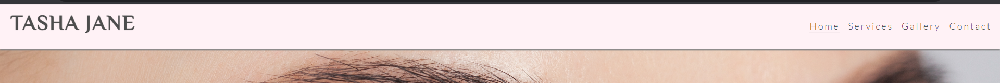

* The navigation bar sits on top of the hero image and acts as the website's header. This navigation bar is located at the same place across all 4 pages; making it easier for users to find their way back and cut through to what they are looking for no matter what page
they are currently on.
* When adjusted to mobile view, the menu links at the top (Home, Services, Gallery, Contact) will change to a dropdown style menu. Where the link names are in desktop and tablet view will turn into a hamburger toggle in mobile view. This is save the screen
contents from becoming too compacted and prevent too much happening at the same time on a much smaller screen.
* The main logo of the company is located to the left of the navigation bar. When this logo is clicked it will take the user straight back to the homepage. Again, this is featured on every page of the website, giving a second option to get back to the landing page.
* A hover effect has been added to the menu names on the right side of the nav bar in desktop view to give the user a clear indication that when clicked, they will be taken to a new page.

*The landing page image*

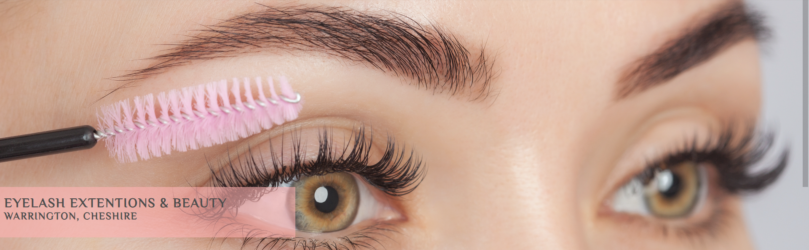

* When entering the landing page, the user is greeted with a larger hero image taking up the majority of the screen. This image was carefully chosen to entice users to stay on the page, rather than users feeling too overwhelmed by it.
* The colours used throughout the website work hand in hand with the colours displayed within the images used. Like this hero image for example, the colour of the header and landing page image are quite similar, so the elements of the page don't look too harsh to a
user when having the first glance at the landing page - which is where the user makes their first impression upon the website as a whole.
* This landing page image also contains a block of cover text placed over the image with a transparent effect applied. This is to give the user a clear indication of what the website is intended for. This is placed over the image as the image will be the first thing
to grab their attention, making it a natural reaction to acknowledge everything in the hero image.

*Brief overview of the services*

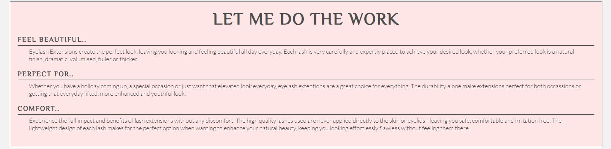

* As the user slightly scrolls down from the hero image on the landing page, they are also presented with a small section containing three smaller headings. This was applied to break up a larger block of text and place it under smaller and separate categories.
* The text inside this section is wrapped in a thin dark border and the width of the section made smaller than the elements at the start of the landing page, this is to separate it from the main hero image and present it as something that is still important to the user, but doesn't immediately draw the attention away from the main landing image.
* Within the context, the smaller headings act as an immediate Q&A with the users. The separated headings are statements to the main queries that a user may have when entering a website that offers services; Why would I want the service? What would I potentially want this service for? What happens after this service? This section directly answers these questions without them being in the form of questions.

*Short review section*

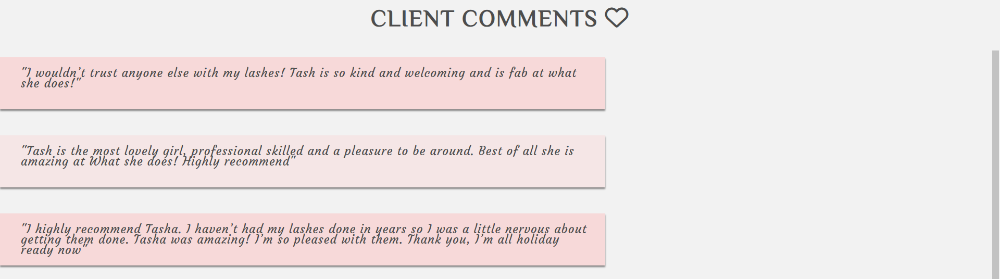

* Underneath the brief overview of the services section, there is a small section dedicated to true client feedback. The 3 quotation feedback comments presented in this section was taken from the company's Facebook reviews section, from different stages and progressions of the business to keep it true and honest. These are applied to the main landing page as it is intended to give the user confidence in knowing that other users with similar interests have been satisfied by the services provided. Hopefully making them feel more inclined to stay within the website to advance further through.
* These are displayed into three separate blocks, with the middle block having a different background colour with the intent to keep the user's attention. These also have a box-shadow effect applied to them, to again keep the contents and styling of the page fun and interesting.
* These are presented smaller than the above sections that are also displayed on the same page (landing page). This is to indicate to the user that we're nearing the end of the page, keeping the contents on this first page brief and simple will entice them to progress through to the other pages in the website.

*Footer*

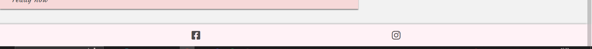

* Located at the bottom of all four pages the user will find the footer. The footer contains links to the relevant social media for the company itself that the project website is based upon. When clicked by a user, this will open a new page directing them to the social media platform pages.
* Rather than having the underlining title links, icons to the social media have been added. This is because having acknowledged that the pages within this website are quite text rich - it gives the user the visual break from scanning through text, which will encourage the user to explore what the icons have to offer; hopefully resulting in users staying connected via the links.

*Services page*

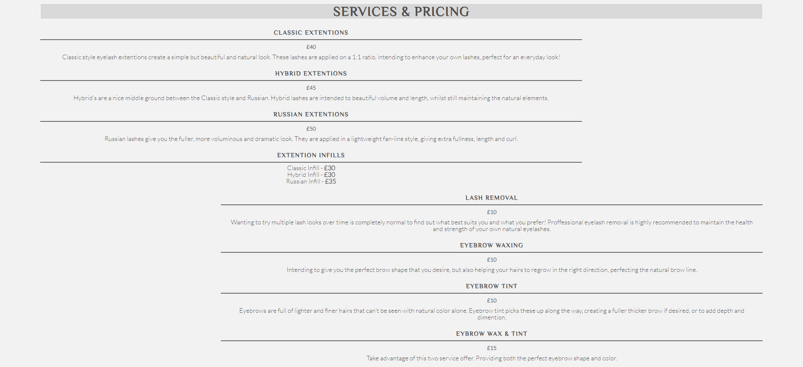

* The contents of this page contains text only. The text is styled appropriately to divide the different services provided onto the left and right sides of the page; with the eyelash services located primarily on the left hand side of the page and eyebrow services located on the right hand side of the page. This is to give the user the choice to read through all of the services, or skip to the side of the page they are interested in.
* The large volume of text on the page is broken up between headings, underlinings, and the use of bold lettering in some locations. This was used to keep relevant content grouped such as the service names, and for other information to remain symmetrical so the user knows automatically where to look after just a few lines; for example, the pricings always being under the service names, if not in bold.

*Gallery page*

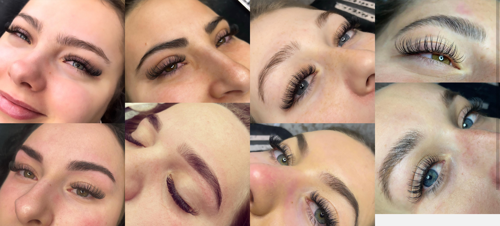

* The gallery provides the users with visual images supporting the services being offered.
* This section of the overall website is particularly important as this acts as the evidence behind the majority of the website content, aiming to restore confidence in users.

*Contact page*

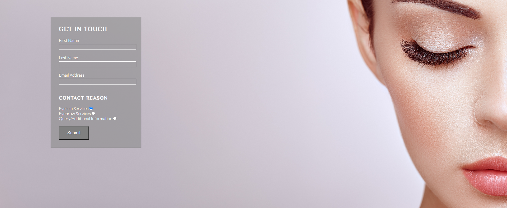

* This page allows the user to get in touch with the company via email. This would be particularly good for users that don't use social media platforms such as Facebook or Instagram - which is currently the only other forms of contact being offered at present.
* The form also features required radio button options. This helps the user feel confident that their more specific service query will be answered in more detail and thoroughly.

With further knowledge and development in the future, I would like to add more interactive features to this website, such as clickable and watchable links within the website and more specific contact forms. For example, sending submitted data into a database for the company to access.

## **Technologies Used** ##

* [HTML](https://developer.mozilla.org/en-US/docs/Web/HTML)
  * Used as the basic building block for the project and to structure the content.
* [CSS](https://developer.mozilla.org/en-US/docs/Learn/Getting_started_with_the_web/CSS_basics)
  * Used to style all the web content across the project.
* [Google Fonts](https://fonts.google.com/)
  * Used to import the fonts linked in the header.
* [Font Awesome](https://fontawesome.com/)
  * Used to obtain the links for the social media icons used in the footer.
* [Google Developer Tools](https://developers.google.com/web/tools/chrome-devtools)
  * Used as a primary method of finding bugs and testing responsiveness of all pages in the website.
* [GitHub](https://github.com/)
  * Used to store the project code after being committed and pushed.
* [Git](https://git-scm.com/)
  * Used for version control by utilizing the Gitpod terminal to commit to Git and Push to GitHub.
* [Balsamiq](https://balsamiq.com/)
  * Used to create the wireframes for the project.
* [Google Docs](https://docs.google.com)
  * Used to fix many grammar and spelling errors.
* [CSS Color Picker](https://www.w3schools.com/colors/colors_picker.asp)
  * Used to pick the colours throughout the project.
* [Favicon.io](https://favicon.io/)
  * Used to create favicon's for the project website.

## **Testing** ##

I used the W3C Markup Validator and W3C CSS Validator  to validate every page of the project to ensure
there were no syntax errors in the project.

* [W3C CSS Validator](https://jigsaw.w3.org/css-validator/)
  * No errors were found when running my CSS code through the CSS Validator. However, one warning was flagging regarding the external google fonts import, but this does not affect the responsiveness of the website.
* [W3C Markup Validator](https://validator.w3.org/)
  * Home page (index.html) - No errors or warnings were found when running my HTML code through the HTML Validator.
  * Services page (services.html) - No errors or warnings were found when running my HTML code through the Validator.
  * Galley page (gallery.html) - No errors or warnings were found when running my HTML code through the Validator.
  * Contact page (contact.html) - No errors or warnings were found when running my HTML code through the Validator.

**Unfixed & Fixed bugs**

* The spacing between the bottom of the images in the Galley page in tablet and desktop view is still yet to be fixed. Whilst spending a considerable amount of time testing different code I wasn't able to make any positive changes without having a negative impact on the rest of the page. This is something I aim to fix with more research and knowledge.
* When changing my unsuitable image file names at the time I struggled to get my hero image to shop up again on all screen sizes even after changing the file name in my CSS. After using dev tools I figured out that I had more powerful code running over the mobile view that still contained the old image file name in the file path. After this fix everything was working how it should and became responsive again.
* Due to the nature of how long widthwise my hero image was, it displayed a more unattractive and irrelevant portion of the hero image when displayed on mobile screens. After research and practice using the background position property, I managed to get a nice section of the hero image to show when being displayed on mobile phone screens.
* When first validating the HTML code in my Gallery page, the validator flagged a warning as my section didn't contain a heading. As I personally didn't want a visible heading in my Gallery page of the website, I created a heading with the display set to none. This removed the warning when my code was then re-validated. I also then re-ran my CSS code through again and the no errors status remained.
* There remained an unfixed warning within my CSS code - this is the use of the external import for the google fonts. This does not immediately affect the responsiveness of my website currently and how it runs, however, with future updates and additional content requiring more imports is unknown. More research and testing from my end will be done about this.

* The form in the Contact page has been fully tested on all screen sizes, ensuring that a valid name, email, and radio button selection is to be used before the submit can go through;
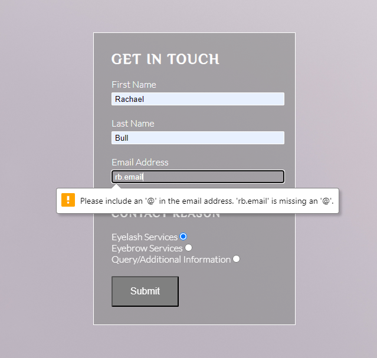
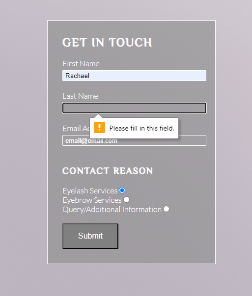

* The nav bar in desktop, tablet and mobile view have been fully tested, ensuring all hover effects, links and toggles work correctly;
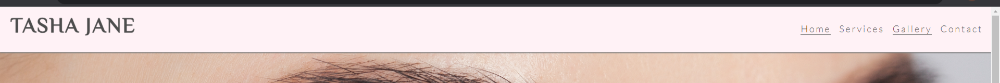
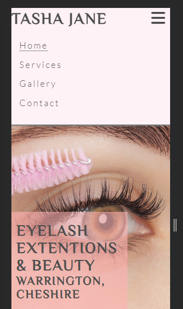

* The social media links in the footer have been tested for all screen types and are working correctly;
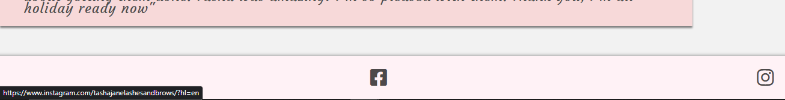

## **Deployment** ##

*Github*

This project is deployed using github, please follow the stages below;

1. Go to your GitHub repository section and select the repository you intend to deploy.
2. Navigate to the 'Settings' link and click it.
3. Inside the settings page to the left hand side (about halfway down) click the 'Pages' link.
4. Underneath the source drop-down tab, find the branch drop-down currently selected to 'None'.
5. Change this branch selection to 'Main' and click 'Save'.
6. Once the 'Main' branch has been selected and saved, the page will be automatically refreshed with a detailed ribbon display to indicate the successful deployment.

It can take a few moments for this save to take effect, so people give this refresh some time.

*Forking with Github*

View or make changes to a repository without affecting the original

1. On Github, navigate to the repository.
2. On the top right hand side of the page, click 'Fork'.
3. Beneath 'Owner', select the dropdown menu and click an owner for the forked repository.

*Making a Clone*

1. On GitHub.com, navigate to the main page of the repository.
2. Above the list of files, click 'Code' and copy the link provided.
3. Open Git Bash.
4. Change the current working directory to the location where you want the cloned directory.
5. Type git clone, and then paste the URL you copied earlier.
6. Press 'Enter' to create your clone.

[Live link to the Repository](https://github.com/RachaelBull/tasha-jane)

## **Credits** ##

*Content*

* [Background-position](https://developer.mozilla.org/en-US/docs/Web/CSS/background-position)
  * This website was used to help me learn about background positions and how to get the correct piece of code I needed to move my hero image to the side in mobile view.

* [Tasha Jane Facebook](https://www.facebook.com/tashaslashstudiox/)
  * This Facebook social media account was used to obtain the client reviews presented at the bottom of the landing home page.

* [Tasha Jane Instagram](https://www.instagram.com/tashajanelashesandbrows/?hl=en)
  * This Instagram social media account was used to retrieve the services information and the pricing shown on the Services page.

* [London Lash Studio](https://londonlashstudio.co.uk/)
  * This website was used for influence and ideas on what I would name the navigation links in the header of each page.

*[Glamorous Lashes](https://www.glamorous-lashes.com/)

* This website was used for influence and inspiration when it came to the small broken down section below the hero image on my landing page, this helped me build upon my idea to add a short Q&A style block of text.

* [Lash Extention Tips](https://www.byrdie.com/lash-extension-tips#:~:text=Eyelash%20extensions%20are%20semi%2Dpermanent,using%20a%20semi%2Dpermanent%20glue.)
  * This is where I obtained and reworded the factual parts of my content, especially on the services page to provide a brief explanation of each service.

*Media*

* [Shudderstock](https://www.shutterstock.com/discover/stock-assets-uk-0220?ds_ag=FF%3DFree_Stock-Images_AU%3DProspecting&ds_agid=58700001308364499&ds_cid=71700000014839559&ds_eid=700000001391652&gclid=CjwKCAjwg4SpBhAKEiwAdyLwvGy9FmZzKZUlek-DFEclBgvBJLaJhmvDRiqpJj7hmW1B46AGAPxi6BoCCNwQAvD_BwE&gclsrc=aw.ds&kw=completely%20free%20stock%20images&utm_campaign=CO%3DUK_LG%3DEN_BU%3DIMG_AD%3DGENERIC_TS%3Dlggeneric_RG%3DEUAF_AB%3DACQ_CH%3DSEM_OG%3DCONV_PB%3DGoogle&utm_medium=cpc&utm_source=GOOGLE)
  * This website is where I obtained all other images. The hero image, and the background image on the contacts page.

* [Tasha Jane Facebook](https://www.facebook.com/tashaslashstudiox/)
  * This social media Facebook account is where I obtained the pictures used in the Gallery page of the website, all pictures on the Facebook page have been approved by clients to be posted publicly.

**Acknowledgments**

*[Code Institute](https://codeinstitute.net/)

I would personally love to give credit and my thanks to Code Institute for all of the very helpful material and thorough teaching. I took inspiration and ideas from their love running project [Love Running Repository](https://github.com/Code-Institute-Solutions/love-running-v3/tree/main) this educated me and made up a vast part of my knowledge and understanding when it came to writing the HTML and CSS.

I would also like to thank and credit my mentor, Harry Dhillon. Harry has helped me understand concepts of coding that I had struggled with even after research. Harry's dedication and patience to his mentees is admirable and is someone I can truly learn a lot from. Harry helped to show me how to navigate my way around Dev Tools to easily find bugs. As mentioned earlier in this document, I had trouble locating a bug with my hero image. During a screen share call Harry was able to teach me how to efficiently use Dev Tools to spot an error, something that I have taken away with me to solve other bugs.

## **Future tips to consider** ##

I have really enjoyed working on this project and feel that I have learnt a great deal from it. As someone who is always looking to better myself, for future references I will aim to make my git commit messages clearer, more consistant, and using a consistant format. For example, starting every commit message with a capital letter to avoid the commits looking messy.

I also aim to use better names for my images, as there was an instance during this project where I had to go back and rename my image files as they contained numbers and characters that are not supposed to be used; causing some time consuming errors down the line.