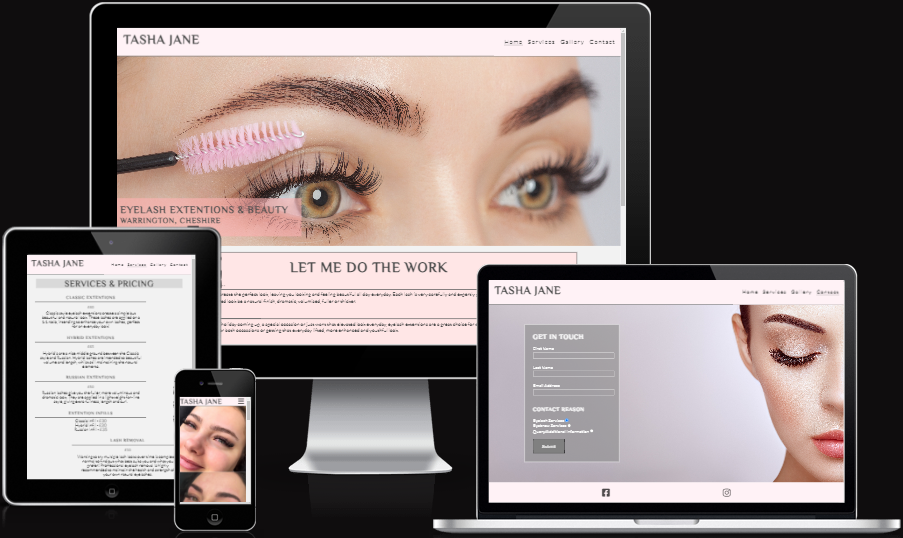

# Tasha-Jane

[Visit the website here](https://rachaelbull.github.io/tasha-jane/)

Created to provide services for people looking for eyelash extensions. This website also includes basic information and explanations for each service; avoiding the presumption that the content is intended for a familiar audience. This website was made only for educational purposes. The idea that this website was based upon was my older sister Tasha. Having had her own beauty business for a couple of years now she has built herself up quite a number of both new and returning clients. Her main forms of contact and
advertisements are through Facebook and Instagram. As I feel very passionate about both my future career and progression in coding and programming, and my sisters business growing, I decided this would be the perfect project to put my heart and hard work into.

## **Introduction** ##

Welcome to my first project - Tasha Jane.

This project is meant for educational purposes only, to showcase my understanding of the languages and teaching I have learnt so far in the modules.
Within this file, I will break down in steps the making of this project website and the logic and reasonings behind it.

This project website is made up of these sections/pages:

1. Home (includes a brief understanding of the website)
2. Services page
3. Gallery page
4. Contact page

## UX

---

## **Strategy Plane** ##

One of the very first things I considered during the planning of this project website was who the audience would be and what they would expect/want.

Tasha Jane's target audience would be:

* Ages 18 and over
* New and regular users of the services
* People interested in the eyelash and eyebrow services provided
* Individuals looking for a brief understanding of the services
* People that have an interest in beauty

What I expect these users would be hoping for:

* Clear, brief information that confirms any basic queries they may have
* Descriptions of each service to help determine the one that's best for them
* Clear, pristine images that give the user an insight to what they are interested in purchasing

The goals from a business perspective are:

* To briefly educate users on the purpose and intention behind each service provided
* To build a bigger base of clients through an additional advertising platform
* To give users a clear and to-the-point indication of the industry and services that are being offered

The goals from a user's perspective are:

* To be able to find information directly related to what's being offered
* Feel comfortable and able to trust the services that are being offered
* Find helpful descriptions of the services to clearly underline the outcome of the services

**Creator Stories**

Firstly, I planned the project around the creators intentions. As the website's purpose is to provide some kind of help and guidance to users, I felt that it was important to go through, in depth, what I thought would be the best experience for my users.

* As a creator, I want to make sure that my website is attractive and intriguing to the human eye, making the user more inclined to remain and explore the website
* As a creator, I intend to make my website easy to use - making sure that the navigation is clear and easy to understand
* As a creator, I want to make my website look interesting but at the same time not have too much going on, for example, carefully picking images that are used and how often I am using them
* As a creator, I want to make the user's feel as though the website was tailored for them and find exactly what they were looking for when they decided to enter into the web link
* As a creator, I intend to make sure that all content is related and that both text and images compliment each other
* As a creator, I want to make sure that the structure of my text is easy to read and helpful especially if users are looking for specifics

**User Stories**

Secondly, after putting together ideas from a creators point of view, I then considered the most important factor in the project planning - the users, specifically first time users.

* As a first time user, I want to easily be able to find factual information on what the website and specific page is intended for
* As a first time user, I want to know almost instantly that this page was targeted for me, by containing exactly what the search engine was stating
* As a first time user, I want to be able to visually see what is being offered and have an image regarding each service that is being offered
* As a first time user, I want the website to act as a guide and provide confidence on what it is I'm looking for
* As a first time user, I want to feel as though I'm getting through the pages in a paced and orderly manner, but not too paced that it would become boring
* As a first time user, I want to be able to clearly see where my navigations and options are, making me feel more inclined to revisit where I left off

With this business being one that's been around for a few years already, the website is intended to not only cater for a new audience, but to include current and returning clients. Whether that be people that already use the company's services and wish to give
the new website a visit rather than the already existing advertising platforms, or people that have received the same or similar services before and wish to return - from within this company in the past or from another company in the past.

* As a returning visitor, I want to be able to find trusted reviews evident images to confirm why I would be wishing to potentially re-use this service
* As a returning visitor, I want to be able to locate other forms of contact throughout the website, such as social media links which link to even more detail of the work and services being offered

This website will include all of the above points. During the planning of this website and its content I did some researching. At first thought of my project idea my plan was to create the project around the idea of the services that the company offers and the
pricing around it with beautiful and evident images to back this us. After research and looking at business pages from well known towns and cities - I would find myself looking into the reviews and feedback from the service users. Here I learnt that many of the
negative reviews came from the lack of knowledge of the service they were purchasing. Having seen these inconsistent reviews, I reverted back to the content of some of the pages, and it was here I learnt that unintentionally some presumptions are made within the
beauty and eyelash industry when it comes to the type of people and age range that use these services. The more I would look at some of the websites I realized that many of them were including beautiful images, very attractive services and price lists layouts - but
very little explanation on what happens during these services - after acknowledging this, I made it a top priority to add basic explanations to the services in my website, making sure that people have a clearer understanding on what it is they would be purchasing.

The research also allowed me to see that there is much more than one age group interested in beauty services, which influenced the way that I planned to design my website. I want my website to be easy on the eyes for a user of any age range and not feel forced or
overwhelmed by the design or content of the pages, keeping in mind that some people may feel uncomfortable or nervous at the thought of beauty treatment, whereas others may regularly use the same or similar services and embrace the thought of treatments.

## **Scope Plane** ##

In order to achieve the desired goals from both a business and user perspective, the following features will be included:

* Navigation and menu bar located at the top of the landing page
* A home page containing a small introduction to the website
* A client review section located at the bottom of the home page
* Footer located at the bottom of all pages containing social media links
* A factual services page containing treatments and prices
* A gallery page containing evident images of the services being offered
* A contact page containing a form to fill in and additional radio buttons to further investigate the query

## **Structure Plane** ##

From the initial stages of the planning for this project website, I knew that I wanted it to be both an advertisement site for a business, but also a website that could provide information for those wishing to try these services for the first time. Finding the balance
for this proved to be quite difficult for me - I was essentially trying to find the fine line between making it educational and reassuring for first time service users, and also basic and straight to the point for the users that visit the website knowing exactly
what is it that they want and what they are looking for. I achieved this by creating a clear menu and navigation bar located at the top of all pages, making it a choice as to whether the user wants to read all of what the landing page has to offer, or skip straight
ahead to find what they are looking for.

In the menu and navigation bar, the structure will be the following: Home > Services > Gallery > Contact. All of these links will direct users to a different page of the website. I chose this layout to again make it easier for first time users to take their time and go through the brief but factual content at their own pace, but allow more seasoned users to progress through the website at their own choosing. I chose this order of pages as they make more sense this way. For example, when visiting the Services page the user is
presented with a services and pricing list combined together, accompanied by a brief description of the expectations after each service. After having read what that the website is offering the next page in line in the menu would be the Gallery page, the images
provided in this page acts as a visual confirmation to the information that is fresh in their minds from the previous page, providing more knowledge and understanding for the user.

Every page except the Services page contains an image of some sort, whether that be an image in the form of a background or part of the Gallery. This is because the aim is to keep the user interested and engaged whilst progressing throughout the website.

I chose lighter, more softer colours throughout this project. This was to create a feel good environment for the user, these colors also complimented the images used as they were all similar colours. The colours I used were:

* Light Pink
* Darker Pink
* Off White
* Dark Grey
* White

The footer located at the bottom of the page will be consistent throughout every page in the website - containing social media links. This is so that the user doesn't always feel too far from the home page and doesn't feel the need to flip back through multiple pages to find the social media links again.

## **Skeleton Plane** ##

[Wireframes](docs/tasha-jane-wireframe.pdf)

Above is the initial wireframe draft of the website. Please note that the finished project website may differ slightly from this.

As well as creating the wireframes to help guide me, I also used a hand drawing version on pen and paper, this made it easier for smaller changes I would think about and quickly gain a visual through drafting them down on paper.

The differences from the initial wireframes are:

* The section below the hero on the landing page was restructured under 3 smaller heading to make the content more organized and attractive to read
* The main heading on the Services page is still bordered, but the actual element size made smaller, this was to stop the page content below from looking too compacted in
* The images in the mobile view on the Gallery page were made larger and more clear from adding length to the images. This has made room for more scrolling, however, from a visual perspective the images are much cleaner
* On the Contact page a background image was added. The majority of the background image lies to the right of the screen, this is why I have kept the form to the left so that the image and form are kept somewhat separate to prevent clashing

## **Surface Plane** ##
